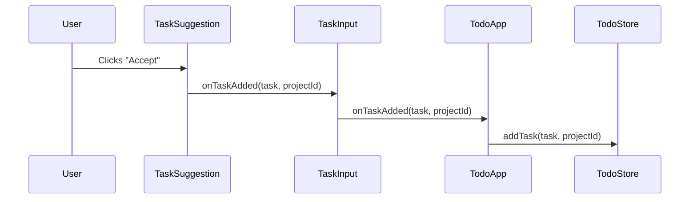

# Component Communication Patterns

## Props Flow Down (Data Binding)

### TodoApp → TaskInput
```typescript
// TodoApp.svelte passes projects to TaskInput
<TaskInput 
  projects={todoStore.getProjects()} 
  onTaskAdded={handleTaskAdded} 
/>
```

### TaskInput → TaskSuggestion
```typescript
// TaskInput.svelte conditionally renders TaskSuggestion
{#if suggestion}
  <TaskSuggestion 
    suggestion={suggestion} 
    onTaskAdded={handleTaskAdded} 
  />
{/if}
```

### TodoApp → ProjectList
```typescript
// TodoApp.svelte passes projects and handlers
<ProjectList 
  projects={todoStore.getProjects()}
  onTaskToggle={handleTaskToggle}
  onTaskDelete={handleTaskDelete}
/>
```

## Events Bubble Up (Callback Pattern)

### Task Creation Flow


### Task Operations Flow
```typescript
// ProjectList → TodoApp
onTaskToggle(projectId: string, taskId: string)
onTaskDelete(projectId: string, taskId: string)

// TodoApp handles all operations
function handleTaskToggle(projectId: string, taskId: string) {
  todoStore.toggleTask(projectId, taskId);
}
```

## State Synchronization

### Reactive Updates
```typescript
// TodoApp.svelte - Single source of truth
const todoStore = createTodoStore([...]);

// All components receive fresh data via props
$: projects = todoStore.getProjects();
```

### State Flow Pattern
```
TodoStore (source of truth)
    ↓ getProjects()
TodoApp (orchestrator)
    ↓ props
Child Components (consumers)
    ↓ events
TodoApp (handler)
    ↓ method calls
TodoStore (state mutation)
```

## ✅ DO: Best Practices

### 1. Use Consistent Identifiers
```typescript
// ✅ ALWAYS use project.id, never project.name
function handleTaskAdded(task: Task, projectId: string) {
  todoStore.addTask(task, projectId); // projectId is actual UUID
}

// ✅ Type-safe event signatures
interface TaskEvents {
  onTaskAdded: (task: Task, projectId: string) => void;
  onTaskToggle: (projectId: string, taskId: string) => void;
}
```

### 2. Single Responsibility Components
```typescript
// ✅ Each component has one clear purpose
<TaskInput />        // Only handles task creation
<ProjectList />      // Only renders project list
<TaskSuggestion />   // Only shows AI suggestions
```

### 3. Proper Service Injection
```typescript
// ✅ Environment-based service selection
export function createTaskSuggestionService(): TaskSuggestionService {
  return import.meta.env.DEV 
    ? new MockTaskSuggestionService()
    : new AnthropicTaskSuggestionService();
}
```

### 4. Consolidated Event Handlers
```typescript
// ✅ Group related operations
interface TaskOperations {
  toggle: (projectId: string, taskId: string) => void;
  delete: (projectId: string, taskId: string) => void;
  edit: (projectId: string, taskId: string, newTitle: string) => void;
  setPriority: (projectId: string, taskId: string, priority: Task['priority']) => void;
}

<ProjectList projects={projects} taskOps={taskOperations} />
```

## ❌ DON'T: Anti-Patterns to Avoid

### 1. Mixed Identifier Types
```typescript
// ❌ NEVER mix IDs and names
function addTask(task: Task, projectId: string) {
  // Bad: trying both name and ID
  let project = projects.find(p => p.name === projectId) || 
                projects.find(p => p.id === projectId);
}

// ❌ Inconsistent parameter types
onTaskAdded(task, "Work Projects"); // Using name
onTaskToggle("uuid-123", taskId);   // Using ID
```

### 2. Prop Drilling
```typescript
// ❌ Too many callback props
<ProjectList 
  onTaskToggle={handleToggle}
  onTaskDelete={handleDelete}
  onTaskEdit={handleEdit}
  onTaskSetPriority={handleSetPriority}
  onTaskMove={handleMove}
  onTaskDuplicate={handleDuplicate}
/>
```

### 3. Direct Store Access in Children
```typescript
// ❌ Child components accessing store directly
// TaskItem.svelte
import { todoStore } from '$lib/stores';
function handleToggle() {
  todoStore.toggleTask(projectId, taskId); // Breaks event flow
}
```

### 4. Hardcoded Service Dependencies
```typescript
// ❌ Hardcoded service selection
export function createTaskSuggestion() {
  const service = new MockTaskSuggestionService(); // Always mock
  return service.getSuggestion();
}
```

### 5. State Mutation in Wrong Places
```typescript
// ❌ Components mutating props
function TaskItem({ task }) {
  task.completed = !task.completed; // Mutates parent data
}

// ❌ Multiple sources of truth
let localTasks = $state([]);  // Duplicates store data
let storeTasks = todoStore.getProjects();
```

## When to Use Stores vs Props

### Use Stores When:
- **Global State**: Data needed across multiple route components
- **Complex State**: Multiple related entities (projects + tasks)
- **State Persistence**: Data that survives component unmounting

```typescript
// ✅ Good: Complex todo state management
const todoStore = createTodoStore();
```

### Use Props When:
- **Component-Specific**: Data only needed by specific component tree
- **Simple Values**: Primitive values or simple objects
- **Event Handlers**: Callback functions for communication

```typescript
// ✅ Good: Component-specific data
<TaskInput projects={projects} onTaskAdded={handleTaskAdded} />
```

## Communication Rules (MANDATORY)

1. **Data Down**: Always pass data via props, never direct store access in children
2. **Events Up**: Always communicate changes via callbacks, never direct mutations
3. **Single Source**: TodoStore is the only state mutator
4. **Consistent IDs**: Always use `project.id` and `task.id`, never names
5. **Type Safety**: All props and events must be typed with interfaces
6. **Service Injection**: Use factory functions, not hardcoded dependencies
7. **Component Boundaries**: Each component has single responsibility
8. **No Prop Drilling**: Max 3 callback props per component

## Violation Detection

### Red Flags in Code Review:
- `project.name` used as identifier
- Direct store imports in child components
- More than 3 callback props
- Hardcoded service instantiation
- Props being mutated directly
- Multiple state sources for same data

## Current Implementation Status

✅ **Working**: TodoApp ↔ TaskInput ↔ TaskSuggestion  
✅ **Working**: TodoApp ↔ ProjectList  
⚠️ **Fix Needed**: Project ID/name consistency  
⚠️ **Fix Needed**: Service injection pattern  
⚠️ **Missing**: Error state propagation  
⚠️ **Missing**: Loading state coordination  