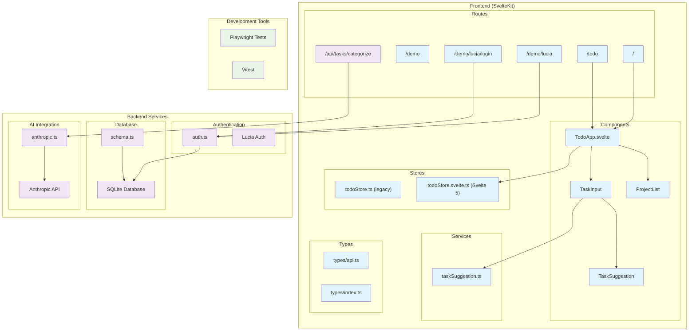
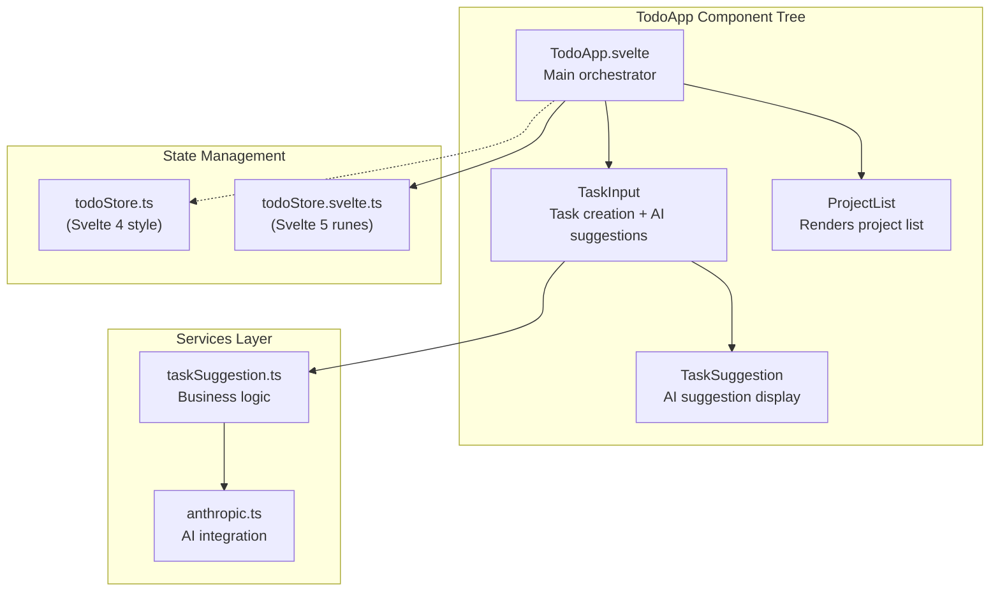
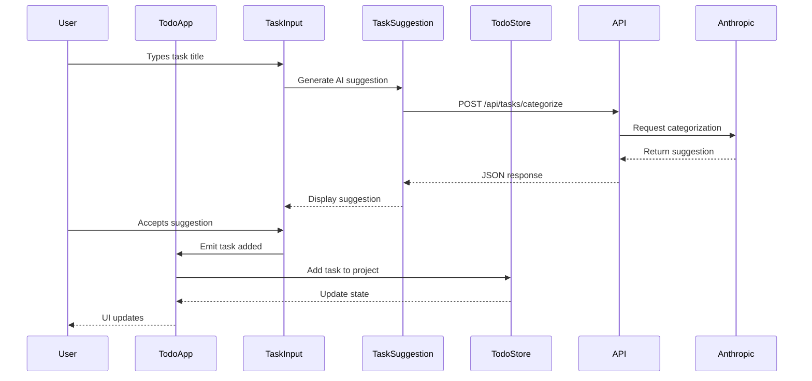
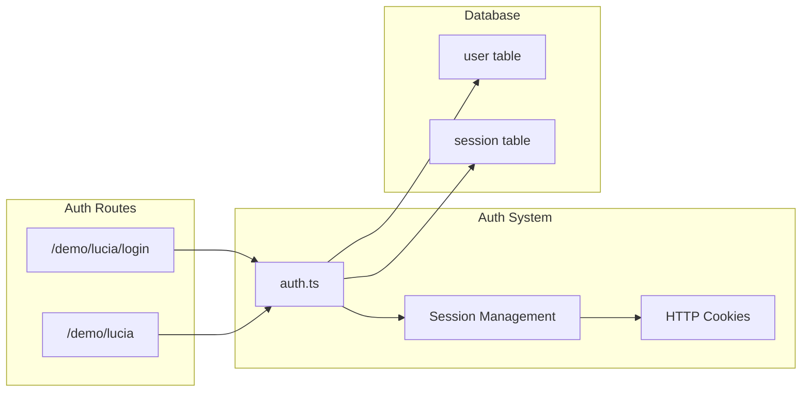
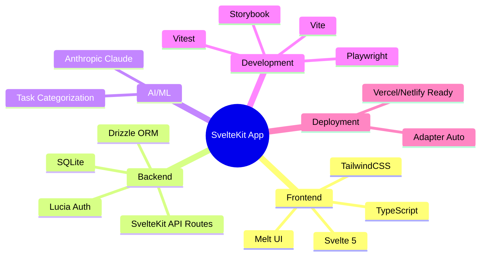

# Application Structure Diagram

## Overall Architecture

```mermaid
graph TB
    subgraph "Frontend (SvelteKit)"
        subgraph "Routes"
            ROOT["/"]
            DEMO["/demo"]
            TODO["/todo"]
            LUCIA_DEMO["/demo/lucia"]
            LUCIA_LOGIN["/demo/lucia/login"]
            API_CATEGORIZE["/api/tasks/categorize"]
        end

        subgraph "Components"
            TODOAPP["TodoApp.svelte"]
            TASKINPUT["TaskInput"]
            PROJECTLIST["ProjectList"]
            TASKSUGGESTION["TaskSuggestion"]
        end

        subgraph "Stores"
            TODOSTORE_OLD["todoStore.ts (legacy)"]
            TODOSTORE_NEW["todoStore.svelte.ts (Svelte 5)"]
        end

        subgraph "Services"
            TASK_SERVICE["taskSuggestion.ts"]
        end

        subgraph "Types"
            API_TYPES["types/api.ts"]
            INDEX_TYPES["types/index.ts"]
        end
    end

    subgraph "Backend Services"
        subgraph "Database"
            DB["SQLite Database"]
            SCHEMA["schema.ts"]
        end

        subgraph "Authentication"
            AUTH["auth.ts"]
            LUCIA["Lucia Auth"]
        end

        subgraph "AI Integration"
            ANTHROPIC["anthropic.ts"]
            AI_API["Anthropic API"]
        end
    end

    subgraph "Development Tools"
        PLAYWRIGHT["Playwright Tests"]
        VITEST["Vitest"]
    end

    %% Connections
    ROOT --> TODOAPP
    TODO --> TODOAPP
    TODOAPP --> TASKINPUT
    TODOAPP --> PROJECTLIST
    TASKINPUT --> TASKSUGGESTION
    TODOAPP --> TODOSTORE_NEW
    TASKINPUT --> TASK_SERVICE
    API_CATEGORIZE --> ANTHROPIC
    ANTHROPIC --> AI_API
    LUCIA_DEMO --> AUTH
    LUCIA_LOGIN --> AUTH
    AUTH --> DB
    SCHEMA --> DB

    %% Styling
    classDef frontend fill:#e1f5fe
    classDef backend fill:#f3e5f5
    classDef tools fill:#e8f5e8

    class ROOT,DEMO,TODO,LUCIA_DEMO,LUCIA_LOGIN,TODOAPP,TASKINPUT,PROJECTLIST,TASKSUGGESTION,TODOSTORE_OLD,TODOSTORE_NEW,TASK_SERVICE,API_TYPES,INDEX_TYPES frontend
    class DB,SCHEMA,AUTH,LUCIA,ANTHROPIC,AI_API,API_CATEGORIZE backend
    class STORYBOOK,PLAYWRIGHT,VITEST tools
```

## Component Hierarchy

```mermaid
graph TD
    subgraph "TodoApp Component Tree"
        TODOAPP["TodoApp.svelte<br/>Main orchestrator"]
        TASKINPUT["TaskInput<br/>Task creation + AI suggestions"]
        PROJECTLIST["ProjectList<br/>Renders project list"]
        TASKSUGGESTION["TaskSuggestion<br/>AI suggestion display"]

        TODOAPP --> TASKINPUT
        TODOAPP --> PROJECTLIST
        TASKINPUT --> TASKSUGGESTION
    end

    subgraph "State Management"
        STORE_LEGACY["todoStore.ts<br/>(Svelte 4 style)"]
        STORE_NEW["todoStore.svelte.ts<br/>(Svelte 5 runes)"]

        TODOAPP -.-> STORE_LEGACY
        TODOAPP --> STORE_NEW
    end

    subgraph "Services Layer"
        TASK_SVC["taskSuggestion.ts<br/>Business logic"]
        ANTHROPIC_SVC["anthropic.ts<br/>AI integration"]

        TASKINPUT --> TASK_SVC
        TASK_SVC --> ANTHROPIC_SVC
    end
```

## Data Flow

```mermaid
sequenceDiagram
    participant User
    participant TodoApp
    participant TaskInput
    participant TaskSuggestion
    participant TodoStore
    participant API
    participant Anthropic

    User->>TaskInput: Types task title
    TaskInput->>TaskSuggestion: Generate AI suggestion
    TaskSuggestion->>API: POST /api/tasks/categorize
    API->>Anthropic: Request categorization
    Anthropic-->>API: Return suggestion
    API-->>TaskSuggestion: JSON response
    TaskSuggestion-->>TaskInput: Display suggestion
    User->>TaskInput: Accepts suggestion
    TaskInput->>TodoApp: Emit task added
    TodoApp->>TodoStore: Add task to project
    TodoStore-->>TodoApp: Update state
    TodoApp-->>User: UI updates
```

## Authentication Flow

```mermaid
graph LR
    subgraph "Auth Routes"
        LOGIN["/demo/lucia/login"]
        MAIN["/demo/lucia"]
    end

    subgraph "Auth System"
        AUTH_SVC["auth.ts"]
        SESSION["Session Management"]
        COOKIES["HTTP Cookies"]
    end

    subgraph "Database"
        USER_TABLE["user table"]
        SESSION_TABLE["session table"]
    end

    LOGIN --> AUTH_SVC
    AUTH_SVC --> SESSION
    SESSION --> COOKIES
    AUTH_SVC --> USER_TABLE
    AUTH_SVC --> SESSION_TABLE
    MAIN --> AUTH_SVC
```

## Technology Stack

```mermaid
mindmap
  root((SvelteKit App))
    Frontend
      Svelte 5
      TypeScript
      TailwindCSS
      Melt UI
    Backend
      SvelteKit API Routes
      Drizzle ORM
      SQLite
      Lucia Auth
    AI/ML
      Anthropic Claude
      Task Categorization
    Development
      Vite
      Vitest
      Playwright
      Storybook
    Deployment
      Adapter Auto
      Vercel/Netlify Ready
```
