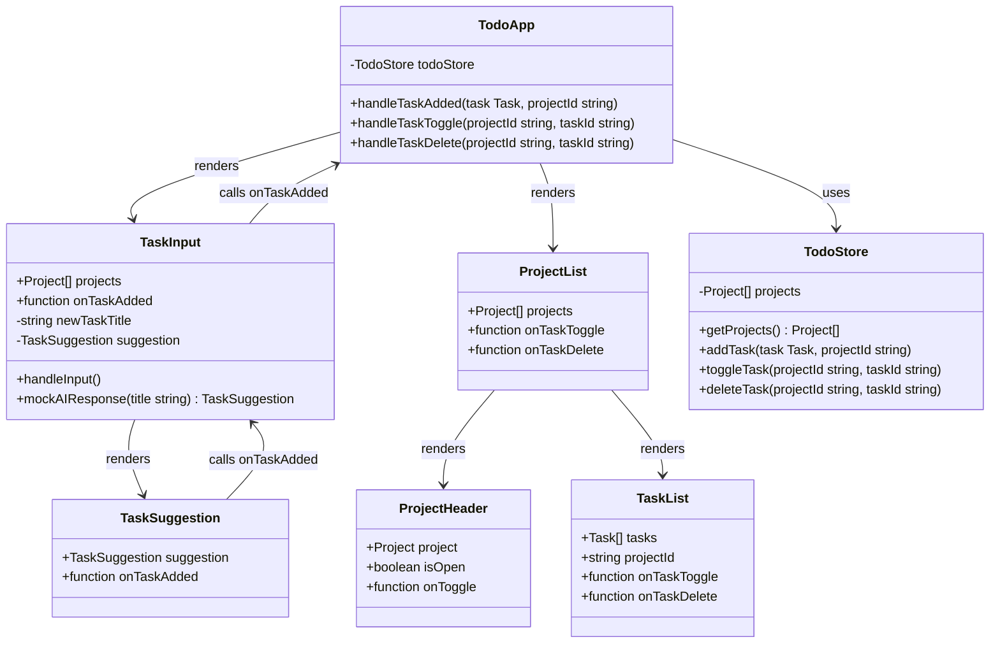
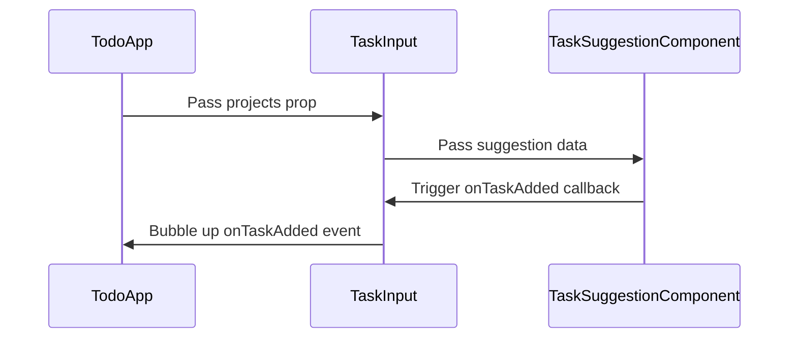
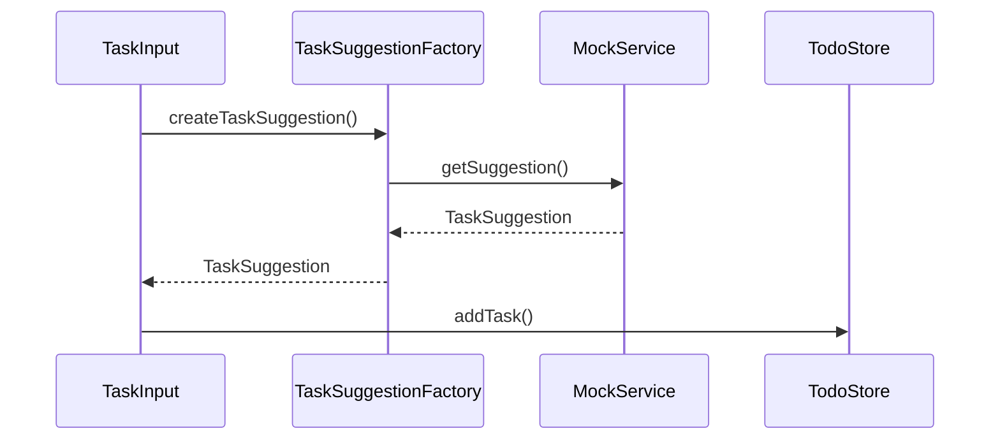

# TodoApp Architecture

This document describes the architecture of the TodoApp application, following SOLID principles and SvelteKit best practices.

## Overview

The application is structured using a layered architecture with clear separation of concerns:

- **Presentation Layer**: Svelte components for UI
- **Service Layer**: Business logic and external API integration
- **Data Layer**: State management and data models
- **Types Layer**: TypeScript interfaces and type definitions

## Current Implementation Status

### ✅ Implemented Components
- **TodoApp**: Main orchestrator ✓
- **TaskInput**: Task creation with AI suggestions ✓  
- **ProjectList**: Renders project list ✓
- **ProjectHeader**: Project header with toggle ✓
- **TaskList**: Task rendering and interactions ✓
- **TaskSuggestion**: AI suggestion display ✓
- **TodoStore**: State management ✓

### ⚠️ Simplified from Architecture
- **No Factory Pattern**: Direct instantiation used for simplicity
- **No Service Interface**: Mock function used instead of service classes
- **No Melt UI**: Replaced with simple onclick handlers for reliability
- **No ProjectCard**: ProjectList directly manages header/tasks

### ❌ Not Yet Implemented  
- **TaskSuggestionService Interface**: Should be added for extensibility
- **AnthropicTaskSuggestionService**: Planned for production AI integration
- **Factory Functions**: Could be added for better testability

## Updated Class Diagram



## Implementation Gaps

### 1. Add Service Interface (Recommended)
```typescript
// src/lib/services/taskSuggestion.ts
export interface TaskSuggestionService {
  getSuggestion(title: string, projects: Project[]): Promise<TaskSuggestion>;
}

export class MockTaskSuggestionService implements TaskSuggestionService {
  async getSuggestion(title: string, projects: Project[]): Promise<TaskSuggestion> {
    // Current mockAIResponse logic
  }
}
```

### 2. Add Factory Functions (Optional)
```typescript
// src/lib/factories/index.ts
export function createTaskSuggestionService(): TaskSuggestionService {
  return new MockTaskSuggestionService();
}
```

### 3. Future: Add Anthropic Service
```typescript
export class AnthropicTaskSuggestionService implements TaskSuggestionService {
  async getSuggestion(title: string, projects: Project[]): Promise<TaskSuggestion> {
    // Anthropic API integration
  }
}
```


### Component Communication Patterns

#### Parent-Child Communication


#### Service Layer Integration


