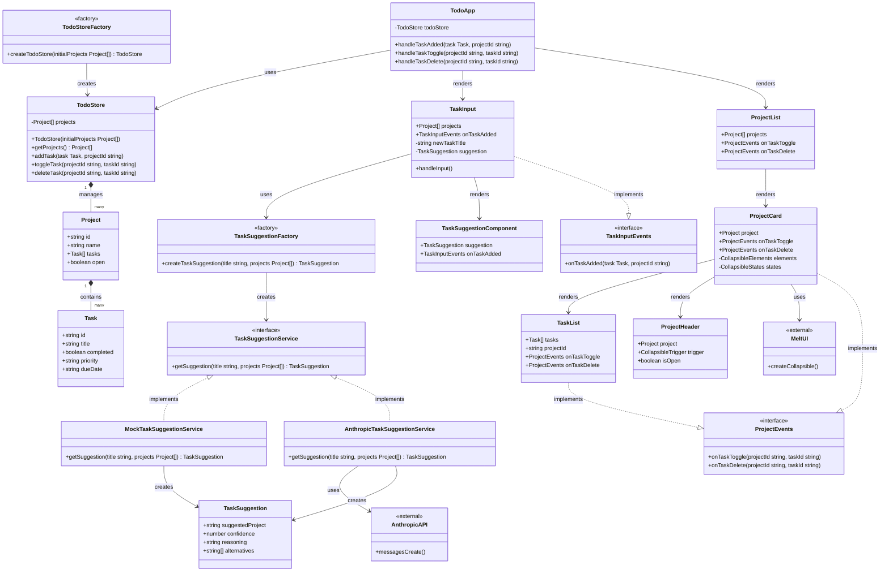
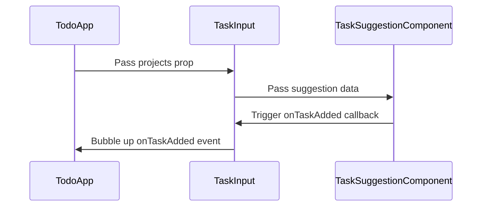
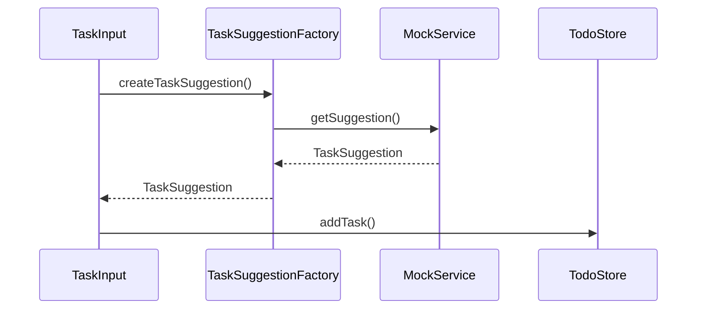

# TodoApp Architecture

This document describes the architecture of the TodoApp application, following SOLID principles and SvelteKit best practices.

## Overview

The application is structured using a layered architecture with clear separation of concerns:

- **Presentation Layer**: Svelte components for UI
- **Service Layer**: Business logic and external API integration
- **Data Layer**: State management and data models
- **Types Layer**: TypeScript interfaces and type definitions

## Class Diagram

## Architecture Principles

### SOLID Principles Applied

#### 1. Single Responsibility Principle (SRP)
- **TodoApp**: Orchestrates the application and handles top-level events
- **TaskInput**: Handles task creation and suggestion display
- **ProjectCard**: Manages individual project display and collapsible behavior
- **TaskList**: Renders and manages task interactions
- **TodoStore**: Manages application state and data operations

#### 2. Open/Closed Principle (OCP)
- **TaskSuggestionService**: Interface allows adding new suggestion providers without modifying existing code
- **Component composition**: New components can be added without changing existing ones

#### 3. Liskov Substitution Principle (LSP)
- **MockTaskSuggestionService** and **AnthropicTaskSuggestionService** are interchangeable
- Both implement the same interface contract

#### 4. Interface Segregation Principle (ISP)
- **TaskInputEvents** and **ProjectEvents** are focused, specific interfaces
- Components only depend on the methods they actually use

#### 5. Dependency Inversion Principle (DIP)
- **TaskInput** depends on the abstraction (TaskSuggestionService) not concrete implementations
- **TodoApp** depends on TodoStore abstraction, not specific state management details

### Component Communication Patterns

#### Parent-Child Communication

#### Service Layer Integration

