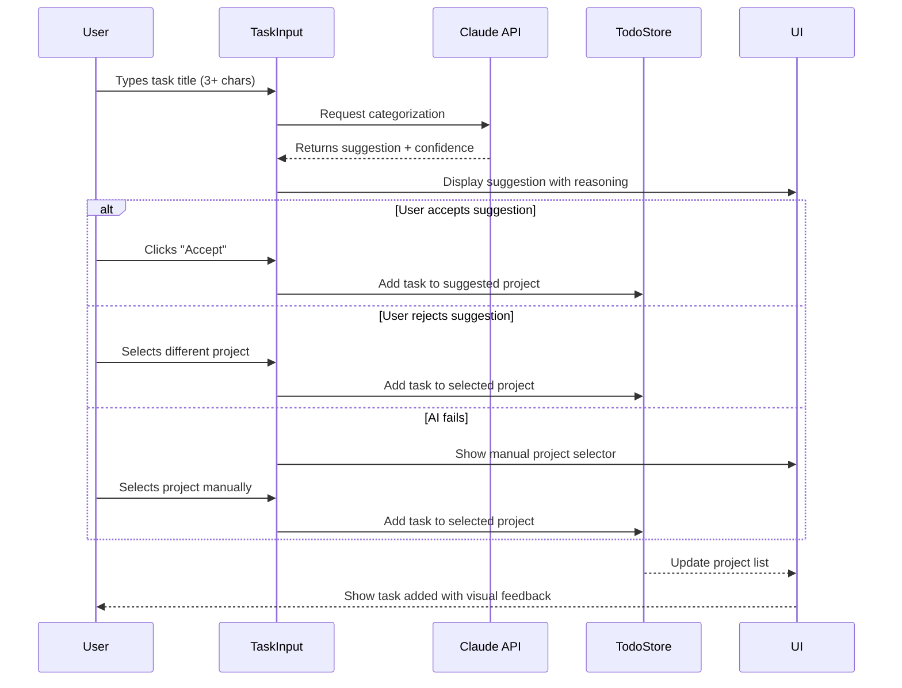
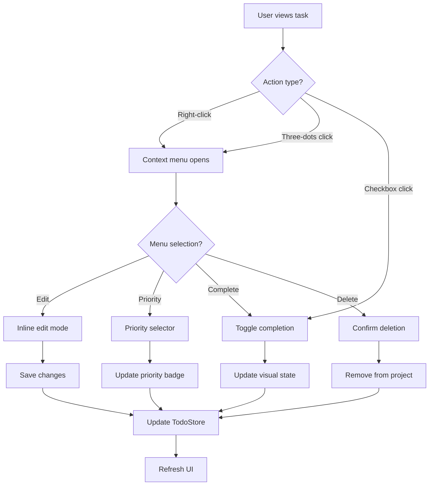
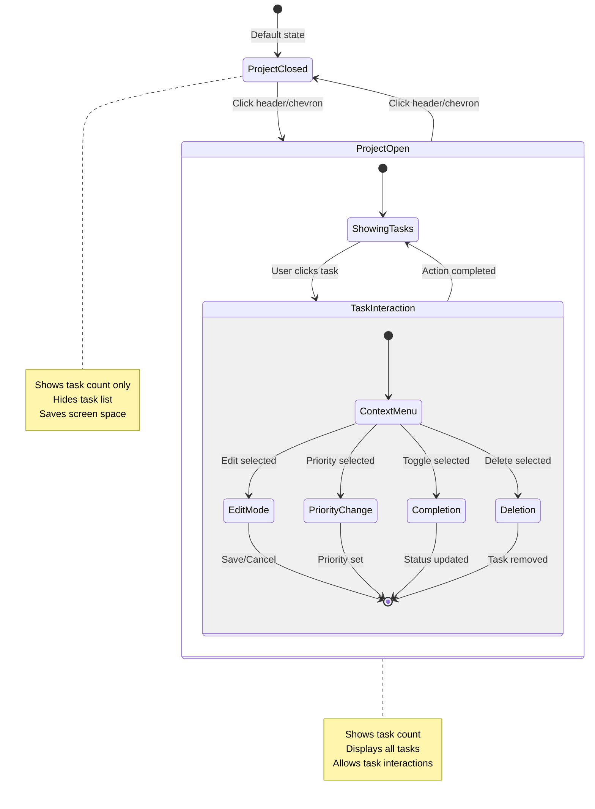
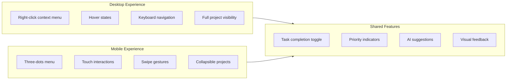
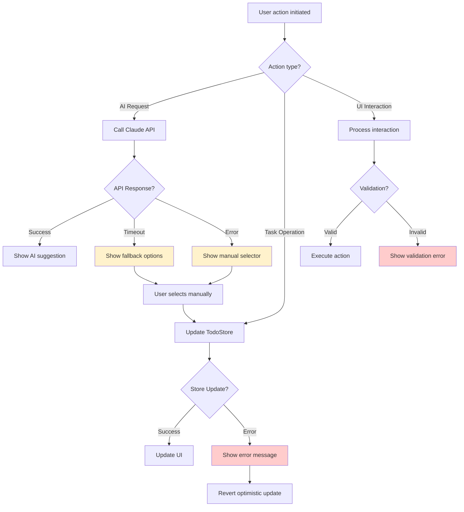
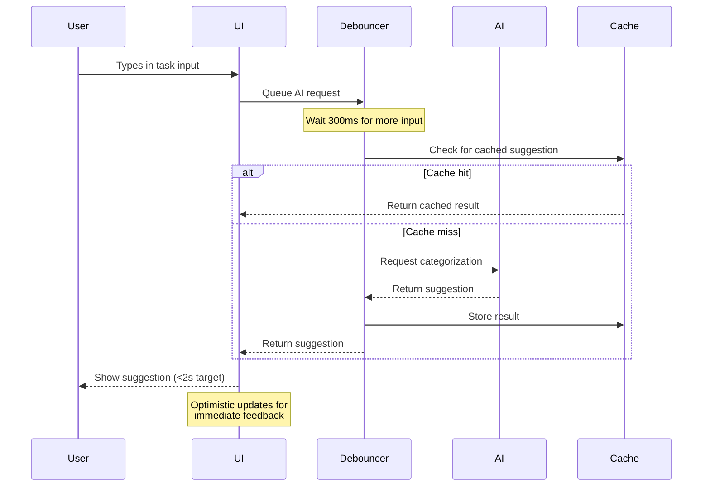

# TodoApp User Scenarios

## Primary User Flows

### 1. AI-Assisted Task Creation

### 2. Task Management Operations

### 3. Project Management Flow

### 4. Responsive Design Scenarios

### 5. Error Handling Scenarios

### 6. Performance Optimization Flow

## User Journey Examples

### New User Onboarding

1. **First Visit**: See demo data with Work/Personal projects
2. **Task Creation**: Experience AI suggestion for "Buy groceries" → Personal
3. **Context Menu**: Discover right-click/three-dots functionality
4. **Project Management**: Learn to collapse/expand projects
5. **Priority Setting**: Set task priorities and see visual indicators

### Power User Workflow

1. **Bulk Task Entry**: Quickly add multiple tasks with AI assistance
2. **Project Organization**: Manage multiple projects efficiently
3. **Priority Management**: Use priority levels for task organization
4. **Keyboard Navigation**: Navigate entirely via keyboard
5. **Mobile Usage**: Seamless experience across devices

### Error Recovery Scenarios

1. **AI Unavailable**: Graceful fallback to manual project selection
2. **Network Issues**: Offline functionality with local state
3. **Invalid Input**: Clear validation messages and recovery options
4. **Accidental Deletion**: Undo functionality (planned feature)

These scenarios guide development priorities and testing strategies, ensuring the app handles real-world usage patterns effectively.
